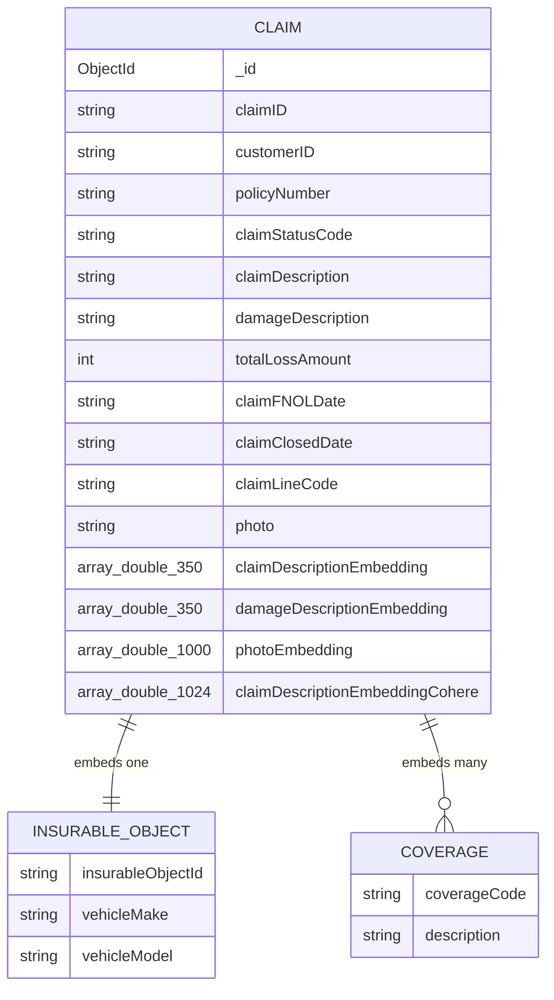

# EDD — Entity Document Diagram

MongoDB Atlas database `demo_rag_insurance`, single collection `claims_final`. Connected
via `MONGODB_URI` (`pymongo.MongoClient`) from `backend/ask_llm.py`,
`backend/embeddingsInitializer.py`, and `backend/scripts/create_vector_search_index.py`.

Field types below were derived from the seeded dataset
(`data/demo_rag_insurance.claims.json`) and the code that reads/writes it, not from a
formal schema — this application defines no JSON Schema validators.

## Entity overview

| Collection | Written by | Read by | Vector index |
| --- | --- | --- | --- |
| `claims_final` | `mongoimport` (seed), `embeddingsInitializer.py` (adds Cohere embedding) | `ask_llm.py` (`vector_search`, via `POST /askTheLlm`) | `vector_index_claim_description_cohere` on `claimDescriptionEmbeddingCohere` |

## claims_final

Seeded via `mongoimport` from `data/demo_rag_insurance.claims.json`. Each document
already carries legacy embeddings from an earlier model; `embeddingsInitializer.py`
adds `claimDescriptionEmbeddingCohere` afterwards by embedding `claimDescription` with
Bedrock's Cohere model. That field is the only one MongoDB Vector Search runs against.

| Field | Type | Notes |
| --- | --- | --- |
| `_id` | ObjectId | Mongo default |
| `claimID` | string | e.g. `"cl105"` |
| `customerID` | string | e.g. `"c105"` |
| `policyNumber` | string | e.g. `"p105"` |
| `claimStatusCode` | string | e.g. `"Subrogation"` |
| `claimDescription` | string | free text; source text for the Cohere embedding and the field returned as `text_key` by `MongoDBAtlasVectorSearch` |
| `damageDescription` | string | free text, separate from `claimDescription` |
| `totalLossAmount` | int | currency units, no explicit field for the currency |
| `claimFNOLDate` | string | ISO-8601 date (`"2023-10-27"`), stored as plain string, not `Date` |
| `claimClosedDate` | string | ISO-8601 date, same caveat |
| `claimLineCode` | string | e.g. `"Auto"` |
| `insurableObject` | object | nested: `insurableObjectId` (string), `vehicleMake` (string), `vehicleModel` (string) |
| `coverages` | array\<object\> | each `{ coverageCode: string, description: string }` |
| `photo` | string | filename, e.g. `"105.jpg"`; not served by this app |
| `claimDescriptionEmbedding` | array\<double\> len=350 | ⚠️ legacy embedding of `claimDescription`, not used for retrieval — see *Known inconsistencies* |
| `damageDescriptionEmbedding` | array\<double\> len=350 | legacy embedding of `damageDescription`; stripped from API responses in `ask_llm.py`, never searched |
| `photoEmbedding` | array\<double\> len=1000 | legacy image embedding; stripped from API responses in `ask_llm.py`, never searched |
| `claimDescriptionEmbeddingCohere` | array\<double\> len=1024 | ✅ added post-seed by `embeddingsInitializer.py`; this is the field the vector index and `vector_search()` actually use |

### Vector search index

Created by `backend/scripts/create_vector_search_index.py` (idempotent — treats
Atlas error code 68, `IndexAlreadyExists`, as success):

| Setting | Value |
| --- | --- |
| Index name | `vector_index_claim_description_cohere` |
| Type | `vectorSearch` |
| Field | `claimDescriptionEmbeddingCohere` |
| Dimensions | `1024` |
| Similarity | `cosine` |

Requires Atlas — `create_search_index` has no equivalent on a local/self-hosted
`mongod`, so this step fails against a non-Atlas MongoDB.

No other indexes beyond the default `_id` index exist on this collection.

## Relationships

All relationships are **logical only** — no foreign keys, no schema validators, no
indexes beyond `_id` and the vector index above. `claims_final` is a single flat
collection; `insurableObject` and `coverages` are embedded, not referenced.

## Known inconsistencies

1. **Two generations of embeddings coexist on every document.** `claimDescriptionEmbedding`
   (350-dim, from the original seed) and `claimDescriptionEmbeddingCohere` (1024-dim,
   added later by `embeddingsInitializer.py`) both embed the same `claimDescription`
   text, but only the Cohere field is indexed and searched. An agent adding a new
   retrieval path must use `claimDescriptionEmbeddingCohere`, not the shorter legacy
   field, or vector search will silently return nothing (dimension mismatch against
   the index). Update this entry if the legacy field is ever removed.
2. **`damageDescriptionEmbedding` and `photoEmbedding` are dead weight in the API
   response path.** `ask_llm.py`'s `vector_search()` deletes both from each result's
   metadata before returning, purely to keep the payload small — neither is ever
   queried. Update this entry if either becomes part of a real search path.
3. **Date fields are strings, not `Date`.** `claimFNOLDate` / `claimClosedDate` are
   ISO-8601 strings inserted as-is by `mongoimport`; no code path converts them to
   BSON dates. Range queries or sorts on these fields need string comparison or an
   explicit cast, not native date semantics. Update this entry if a migration adds
   real `Date` typing.
